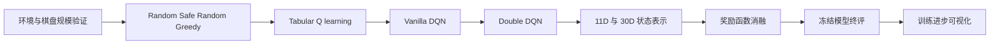

# DSA5102 Final Group Project

本仓库用于完成 DSA5102 Foundations of Machine Learning 期末小组项目。小组选择题目方向 2：使用强化学习训练智能体玩经典游戏 **贪吃蛇（Snake）**。

> 截止日期：November 22nd（题目原文未注明年份）。

## 仓库导航

- [贪吃蛇项目详细方案](DSA5102_方向2_贪吃蛇方案.md)
- [强化学习学习笔记](DSA5102_强化学习学习笔记.md)
- [可运行实验框架 Notebook](Chat老师小课堂--DSA5102%20Final%20Project%20贪吃蛇RL实验框架.ipynb)
- [贪吃蛇实验链总览](docs/snake-experiments/00-overview.md)
- [实验文档索引](docs/snake-experiments/README.md)

## 一 作业目标

本项目旨在帮助学生熟悉：

1. NumPy、pandas、Matplotlib、seaborn 等 Python 数据处理与可视化工具；
2. scikit-learn、Keras 等常用机器学习库；
3. 数据分析与机器学习中的科学研究方法。

## 二 提交形式

全组在 Canvas 提交以下两项材料：

1. 一份 Jupyter Notebook，作为完整项目报告；
2. 一段包含所有组员讲解的视频。

### Notebook 要求

- Notebook 必须能够直接运行。若部分训练耗时较长，应一并提交已保存模型，并在代码中设置 `TRAIN_MODEL = False`，使阅卷者可以直接加载模型。
- 使用 Markdown 与代码注释清楚解释每一步、实验发现及其意义，把报告写成连贯的“essay”。
- 每组 4–5 人，不接受个人提交；每组只提交一份报告。
- 在报告中如实声明成员贡献。若声明所有成员贡献相同或不作声明，成员通常获得相近分数；若逐项声明个人贡献，则可能按贡献获得不同分数。
- 必须说明生成式 AI 的使用方式和用途。若声称未使用但存在可靠证据，将被视为抄袭，项目报告和视频均记零分。
- 尽可能随 Notebook 和视频上传数据集；若数据过大，应在 Notebook 中提供数据集链接。

### 视频要求

- 5 人组总时长 20 分钟，4 人组总时长 16 分钟；每人讲解约 4 分钟；全组提交一段合并视频。
- 内容应基于小组项目，包括研究动机、数据集或游戏可视化、方法、算法与实现结果；无需现场运行代码。
- 视频用于检验组员是否真正理解报告。若不熟悉自己负责的内容，报告与视频成绩都可能受到影响。
- 必须由真人讲解，禁止使用合成讲解者或合成声音；违反要求时报告与视频均记零分。
- 幻灯片不是必需品；如有助于讲解可自行制作，但无需提交。

## 三 题目选项

每组完成以下两个方向之一。

### 方向 1 数据分析

选择一个数据集，完成三个不同的监督或无监督学习任务，其中至少包含一个监督学习任务和一个无监督学习任务；第三个任务可任选。

- 每个任务至少使用两种不同方法并比较性能；同一算法的不同超参数不算不同方法。
- 监督学习应使用交叉验证进行模型选择。
- 无监督学习应使用内部指标、可视化或结合项目背景的解释，例如聚类的 Silhouette score 或类内 MSE。
- 若报告包含两个同类型任务，则整个项目至少使用三种该类型的不同方法。

### 方向 2 强化学习游戏 本项目选择

使用强化学习训练机器玩经典或知名游戏，例如 Breakout、Snake、Tetris、Super Mario 或 Atari Games 中的其他游戏。

- 用可视化方式展示电脑游戏水平如何随训练推进而提高；
- 探索提升电脑玩家强度的方法，并比较不同方法的性能；
- 报告必须包含 baseline、learning curves，以及跨多个 episodes 的评估；
- 需要介绍游戏并配合可视化，假设读者从未玩过该游戏。

也可以提出不完全属于以上两类的创意方向，但应提前邮件询问教师是否接受。

## 四 评分标准

项目报告满分 20 分，视频展示满分 10 分。

### 项目报告

1. 是否完成题目要求；
2. 方法是否科学正确；强化学习方向特别重视实验严谨性；
3. 是否正确使用相关库；
4. 游戏或数据介绍、可视化、代码和发现是否清楚；方向 2 还会考察游戏复杂度与最终智能体强度；
5. 创意与呈现风格。

### 视频展示

1. 表达是否清晰连贯；
2. 是否真正理解项目；
3. 时间安排是否合理。全组超时达到 2 分钟或以上时，原则上每超时 30 秒，每位成员扣 0.5 分，实际扣分结合个人用时；
4. 视频分数与报告分数可能相关联。

## 五 数据集资源 原题方向 1 参考

可选择课堂演示中没有使用过、且与小组兴趣相关的数据集。原题推荐资源包括：

- UCI Machine Learning Repository
- Kaggle
- data.gov.sg

备选数据集包括 Heart Disease、Retail Data Analytics、Atomization Energies and DFT、New York Stock Exchange、Traffic Signs 与 COVID-19。

## 六 本项目的贪吃蛇研究主线

本项目不以“堆叠尽可能多的模型”为目标，而以单变量对照、多随机种子和冻结测试协议建立可信证据。推荐主线如下：

核心比较应使用游戏原生 `score`（吃到的食物数），并补充生存步数、每个食物所需步数、超时率、撞墙率、自撞率、学习曲线 AUC 与训练耗时。跨奖励函数时，不应直接用刻度不同的 total reward 宣称某方案更强。

## 七 合规与复现检查

- 最终 Notebook 能在干净环境中运行；长训练默认关闭并加载已保存权重；
- 保存模型权重、完整配置、算法版本、奖励方案、训练 seed、训练历史和环境版本；
- 明确区分 train、validation、test seeds；最终测试只在方案冻结后运行；
- 用多个训练 seeds 和每个模型多局评估报告均值与离散程度，不挑选单次最好结果；
- 同时展示成功与失败案例；
- 填写真实成员贡献与真实生成式 AI 使用声明；
- 视频由所有成员真人完成，并提前控制总时长。

## 八 当前状态

仓库现阶段主要提供项目方案、理论学习材料与实验代码骨架。实验文档中的“预期结果”均为待验证假设；最终报告必须用真实运行产生的表格、曲线、录像与失败案例替换占位内容。
