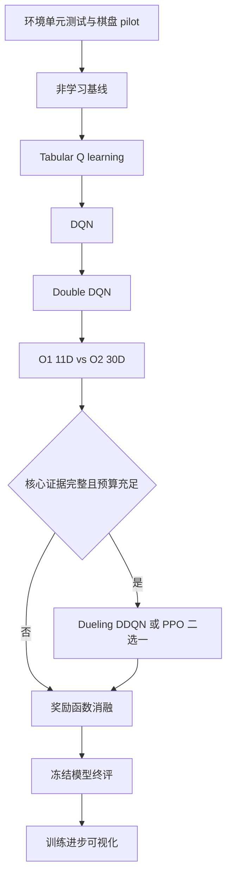

# 贪吃蛇强化学习实验链整体概述

## 项目要回答的问题

在计算预算受限的贪吃蛇环境中，智能体性能的主要瓶颈究竟来自价值学习算法、状态表示的信息损失，还是奖励信号设计？项目将通过逐层增加复杂度、一次只改变一个主要因素来回答这一问题。

## 游戏与统一建模

- 候选主环境为 `10 × 10` 网格、初始蛇长 3；正式采用前必须通过棋盘规模预实验。
- 动作空间优先使用三个相对动作：直行、右转、左转，天然排除 180 度掉头。
- 基础观测 O1 为 11 维：前/右/左危险 3 维、当前方向 4 维、食物相对方向 4 维。
- O1 不是完整 Markov state，因为它不包含完整蛇身布局；这正是状态表示实验要检验的限制。
- 每局以吃到的食物数作为原生 `score`，并设置无进食步数上限，防止无限绕圈。

## 实验链

## 统一实验协议

| 项目 | 统一规则 |
|---|---|
| 主指标 | 每局 `score`，即吃到的食物数 |
| 辅助指标 | episode steps、steps per food、timeout rate、wall/self collision rate、训练耗时 |
| 学习效率 | 固定 checkpoint 的 evaluation curve、曲线 AUC、达到阈值所需 environment steps |
| 重复实验 | 核心实验至少 3 个训练 seeds，预算允许时 5 个 |
| 最终评估 | 每个训练 seed 在固定 test seeds 上评估 100 局 |
| 公平性 | 相同环境版本、终止规则、训练步数、评估局面与尽量相近的参数规模 |
| 数据隔离 | train seeds 用于训练，validation seeds 用于选择，test seeds 只在冻结后使用 |
| 不确定性 | 先求每个训练 seed 的 100 局均值，再跨训练 seeds 报 mean、SD 与区间 |

跨奖励方案比较时，total reward 的刻度不同，因此不能作为方案强弱的统一主指标。

## 核心产出

1. 环境测试记录和棋盘大小选择证据；
2. Random、Safe Random、Greedy、Tabular Q、DQN、DDQN 的公平比较；
3. O1 与 O2 状态表示对比；
4. Sparse、Step penalty、Potential shaping 奖励消融；
5. 多 seed 学习曲线、最终 score 分布、死亡类型和行为诊断；
6. 0%、25%、50%、75%、100% checkpoint 的同局面训练进步视频；
7. 可直接运行、默认 `TRAIN_MODEL = False` 的最终 Notebook 和保存模型。

## 结果解释原则

“预期结果”是实验前假设，不是结论。Dueling、PPO 或更高维状态可能没有提升；只要实验设计公平、数据完整且解释诚实，负结果同样有价值。
